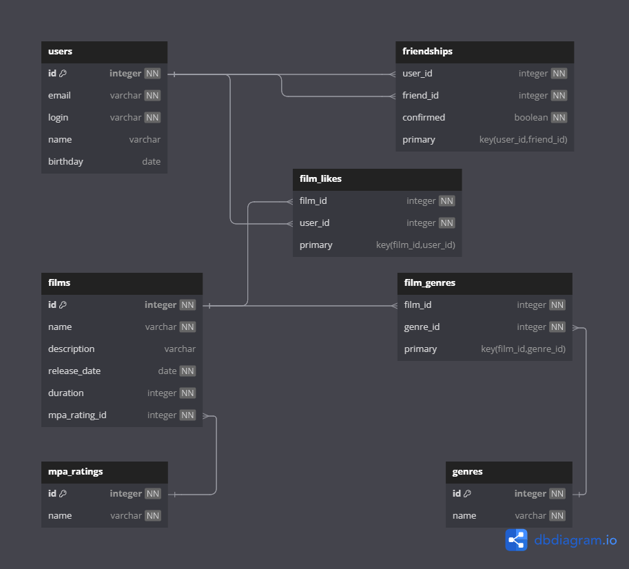

# java-filmorate

## ER-диаграмма базы данных


[Ссылка на ER Диаграмму](https://dbdiagram.io/d/680fc3ad1ca52373f5b2bbc2)

На диаграмме изображены таблицы и связи проекта Filmorate:
- `users` — пользователи приложения
- `films` — фильмы
- `genres`, `mpa_ratings` — справочники жанров и рейтингов
- `friendships` — таблица дружбы между пользователями
- `film_likes` — лайки фильмов
- `film_genres` — связь фильмов и жанров

## Примеры SQL-запросов 

### Получение всех пользователей
```
SELECT * FROM users;
```
### Получение всех фильмов
```
SELECT * FROM films;
```
### Получение фильма по ID
```
SELECT * FROM films WHERE id = 1;
```
### Посмотреть всех друзей пользователя
```
SELECT * FROM friendships WHERE user_id = 1;
```
### Посмотреть все лайки фильма
```
SELECT * FROM film_likes WHERE film_id = 1;
```
### Посмотреть жанры фильма
```
SELECT * FROM film_genres WHERE film_id = 1;
```